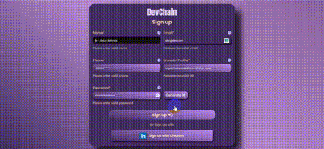
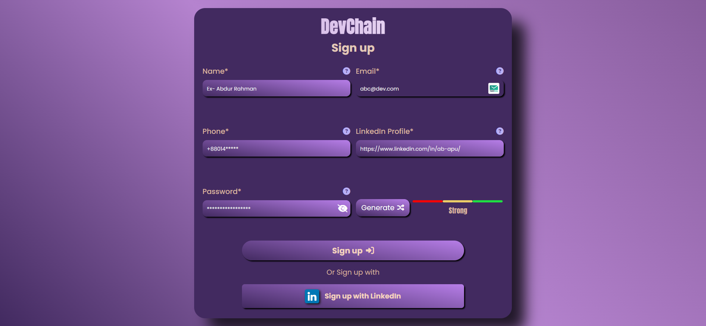
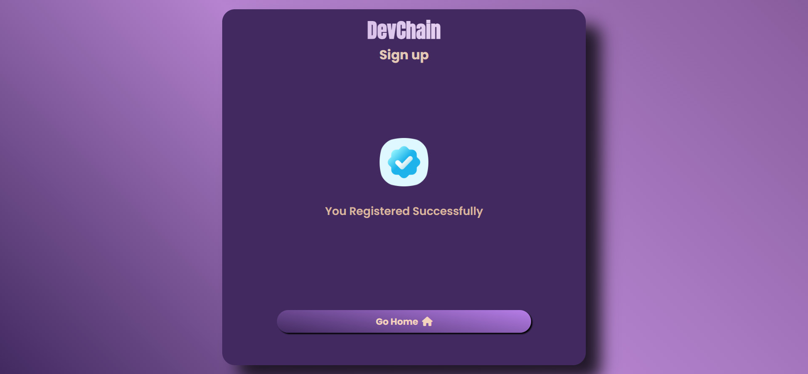

# 🌟 Signup Form with Validation 🌟


🔒 A modern, fully responsive signup form built with **HTML**, **CSS**, and **JavaScript**, featuring real-time form validation, password generation, and a beautiful, user-friendly interface.

---


_Demo of the Signup Form in Action: This GIF showcases the form filling process, including validation and error handling._

🔗 [Try the Live Demo](https://abdur-rahman-apu.github.io/Signup-form/)

---

## 🎨 Screenshots





---

## 🚀 Features

- ✅ **Form Validation**:

  - 🔤 **Name**: Only allows uppercase, lowercase letters, and spaces.
  - 📧 **Email**: Supports standard formats like `name@domain.com` or `name@domain.bd`.
  - 📱 **Phone**: Supports Bangladeshi mobile number formats: `+8801793614417`, `8801939409322`, `01981504997`.
  - 🔑 **Password**: Ensures password strength with rules:
    - At least one uppercase letter.
    - At least one lowercase letter.
    - At least one number.
    - At least one special character.
    - Minimum length: 8 characters.
  - 🌐 **LinkedIn Profile**: Validates LinkedIn profile URLs like `https://www.linkedin.com/in/your-profile/`.

- 🔐 **Password Generator**: Automatically generates a secure, 12-character password using ASCII values.

- 💪 **Password Strength Indicator**: Displays strength (weak, medium, strong) based on compliance with password rules.

- 🎨 **Modern UI/UX**: A beautiful and responsive design focused on user experience.

- ⚡ **Real-time Error Handling**:

  - Shows error messages for invalid inputs.
  - Automatically hides errors when the user starts typing.

- 🎉 **Success Page**: After successful validation, a success page is displayed, with an option to return to the signup page.

- 📱 **Fully Responsive**: Works seamlessly on mobile, tablet, and desktop devices.

---

## 📋 Validation Rules

| Input Field              | Validation Rule                                                           | Regular Expression                                                                                |
| ------------------------ | ------------------------------------------------------------------------- | ------------------------------------------------------------------------------------------------- |
| **Name**                 | Only uppercase, lowercase letters, and spaces.                            | `/^[a-zA-Z ]+$/`                                                                                  |
| **Email**                | Lowercase letters, hyphen, numbers, `@`, and dots.                        | `/^[a-z\d-]+@[a-z\.]+\.[a-z]+$/`                                                                  |
| **Phone (Bangladesh)**   | Format: `+88` or `88`, followed by `01`, next digit `3-9`, 8 more digits. | `/^\+?(88)?(01)[3-9]\d{8}$/`                                                                      |
| **Password**             | At least one uppercase, lowercase, digit, and special character.          | `/^(?=.*[a-z])(?=.*[A-Z])(?=.*[\d])(?=.*[\!"#$%&'\(\)\*\+,-\/:;\<\>\?@`{}\|~\[\]^\.\\\_]).{8,}$/` |
| **LinkedIn Profile URL** | Only valid LinkedIn profile URLs.                                         | `/^https:\/\/www\.linkedin\.com\/in\/[a-z\-]+\/$/`                                                |

---

## 🔑 Password Generation

🔒 The **Password Generator** feature creates strong, secure passwords tailored to your needs! Here’s what it offers:

### 📝 Password Characteristics:

- **🔢 Length**: 12 characters for enhanced security.
- **🎭 Complexity**: Includes at least one:
  - Uppercase letter (A-Z) 🅰️
  - Lowercase letter (a-z) 🅱️
  - Digit (0-9) 0️⃣
  - Special character (e.g., !@#$%^&\*) ✨

### ⚠️ Compliance:

- Ensures adherence to all password rules for maximum security.

💻 **Example**: By clicking the "Generate Password" button, the password field is automatically filled with a randomly generated, secure password.

---

## 📊 Password Strength Indicator

🔐 The **Password Strength Indicator** evaluates the password based on the following criteria:

- **Strong** 💪: Meets all validation rules.
- **Medium** 🟡: Missing at least 1 rule.
- **Weak** 🔴: Missing all rules.

---

## 💡 How to Use

1. **Clone the repository**:
   ```bash
   git clone https://github.com/Abdur-Rahman-Apu/Signup-form.git
   ```
2. Open the **index.html** file in your browser 🖥️

3. Fill in the form: 📝

   - The form validates inputs in real-time.⏱️
   - Error messages are shown for invalid inputs.❌

4. **Generate a secure password** using the "Generate Password" button. 🔐

5. **Submit the form** and, if all inputs are valid, you'll be redirected to the success page. ✅

   ***

## 🛠️ Challenges Solved

Overcoming challenges is part of the journey! Here are some key obstacles I tackled during this project:

- **🔑 Password Generation**: Developed a robust password generator that utilizes ASCII characters to create strong passwords.

- **💪 Password Strength Evaluation**: Implemented a real-time strength checker that evaluates password strength as users type, ensuring compliance with security rules.

- **⚙️ Event Handling**: Mastered event handling by manually triggering input events using `dispatchEvent`, allowing for seamless handling of dynamic changes in the form.

---

## 📱 Responsive Design

Our sign up form is **fully responsive**, ensuring a seamless experience across all devices! 🌟

- **Adaptive Layout**: The form adjusts beautifully to different screen sizes, making it user-friendly on:
  - **Desktops** 💻
  - **Tablets** 📱
  - **Mobile Devices** 📲

Experience optimal usability whether you're at home, in the office, or on the go! 🚀

---

## 🛠️ Technologies Used


---

## 🙏 Acknowledgements

### 🌟 Inspiration

- A special thanks to [JavaScript Ninja Bootcamp](https://webdeveloperbd.net/js-bootcamp/) for inspiring this project.

### 📚 Resources

- **Documentation**: [MDN Web Docs](https://developer.mozilla.org/) for providing excellent documentation.
- **Design Inspiration**: [Dribbble](https://dribbble.com/) for creative design ideas.
- **Fonts**: [Google Fonts](https://fonts.google.com/) for a wide selection of fonts.
- **Icons**: [FontAwesome](https://fontawesome.com/) for beautiful icons.
- **Troubleshooting & Guidance**: [Stack Overflow](https://stackoverflow.com/) for valuable community support.

---

## 📜 License

This project is licensed under the MIT License.  
See the [LICENSE](LICENSE) file for details on usage and distribution.

---

## 👨‍💻 Author

### 👤 **Abdur Rahman Apu**

- **LinkedIn**: [Connect with me!](https://www.linkedin.com/in/abdur-rahman-apu/) 
- **GitHub**: [View my projects](https://github.com/Abdur-Rahman-Apu) 

---

## 📫 Contact

For any inquiries, suggestions, or feedback, please reach out via email:  
[abdurrahmany418@gmail.com](mailto:abdurrahmany418@gmail.com)

You can also connect with me on [LinkedIn](https://www.linkedin.com/in/abdur-rahman-apu/)

---

## 📅 Future Improvements

- Implement a back-end server for storing user data.
- Enhance accessibility features for better user experience.

---

## 👀 Show your support

If you like this project, please ⭐ the repository!

### Thank you for visiting! 🚀
